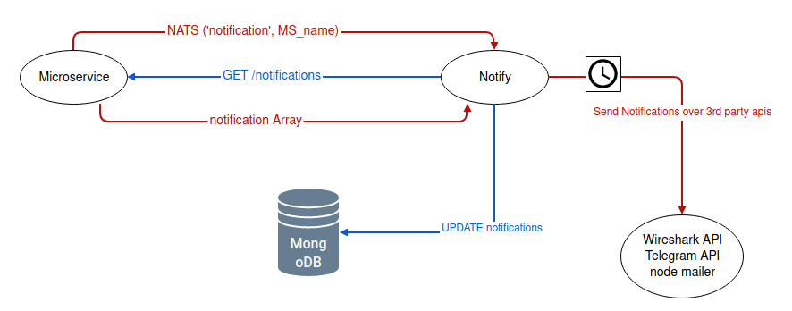
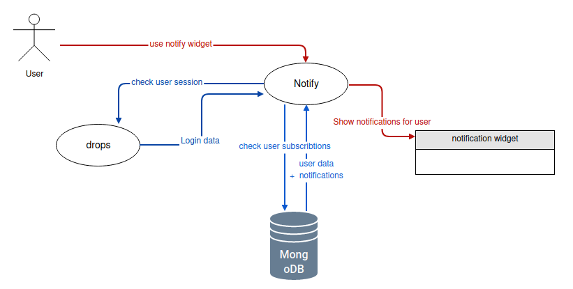

# Notify-backend

Backend for notification system for the VcA Pool² statem.
Collects notification data from connected Microservices and sends them to frontend widget our directly to the users via Third-party tools (Telegram, Mail, Push, ...).

Consist of:
Mogodb Database
Node.js App

both running in docker container

# Build status

  

## Features

- REST API
- NATS server
- MongoDB
- REDIS

## Requirements

For user authentication:

- Running redis-api nats-api and nginx-api from https://github.com/Viva-con-Agua/api-deploy

(For testing purposes - user authentication can be done locally (See: ))

## Installation

For Development:

- git clone https://github.com/Viva-con-Agua/notify-backend

- start MongoDB Database

  - run on local server or with docker: docker-compose up notify-database
  - MongoDB should be running on port 27017 with credentials
    username = notify
    password = notify
  - check if database is running correctly by trying to connect to it (for example with MongoDB Compass)

- start Nats, Redis and Nginx server

  - run docker-compose up nats-api redis-api nginx-api on https://github.com/Viva-con-Agua/api-deploy project

- start drops backend and database

  - run docker-compose up on https://github.com/Viva-con-Agua/drops-backend project

- load mongodb dump

  - go to ./config and run: mongodump --host="localhost" --port="27017" -u="notify" -p="notify"

- npm install
- change config/development.env to .env and change values if your database or anything else is running on different ports

- npm run dev

If you want to run the backend without authentification from drops work with branch 'without_authentification'.
There you work with an Mongo dump with an example user and have an own running nats server in docker-compose.

## Set up new Microservice

It is recommended to use the SETUP functionalityy of vca_widget_notify to set up a Microservie and configure what notifications should be handled in which manner.

1. Your Microservice needs an REST API Endpoint which provides the following array of notifications:
   [{
   <b>Microservice: </b>name of Service,
   <b>type: </b>type of Notification*, 
   <b>date: </b>current date and time,
   <b>validTill: </b>when the notification becomes irrelevant,
   <b>typeId: </b>id which together with type should make the notification
   unique,
   <b>layoutParameters: </b>parameters needed for displaying all important
   information,
   <b>matchingParameters: </b>parameters needed for matching the notification
   to interested users
   }]

   for an example see: https://github.com/Viva-con-Agua/waves-backend/blob/notify/controller/notificationController.js

2. Test if the API is reachable and the data has the correct format

POST /TestAPI
{
'name': $Microservice_name,
'api': $Microservice_api,
}

if everything is correct, the Microservice will be saved in database as an Notification endpoint (collection: 'microservices')

3. Set categories for your notification types

POST /saveCategories
{
'Microservice': $Microservice_name,
    'types': [{$type: ( "Aktionen" || "Crew Info & Soziales" || "Spenden & Projekte") }],
}

4. Set Pipelines over which the users can subsribe to your notifications

POST /saveConditions
{
Microservice: $Microservice_name,
              conditions: [{$type: $pipeline_data}],
              types: [$types ],
missing: [$pipelines you wnat to delete],
}

All setup functions are in /controller/settingscontroller.js

### Example configuration

If you want a example configuration, in config sql-dumps is one for WAVES as an Microservice that sends notifications to notify.

- start the waves-backend https://github.com/Viva-con-Agua/waves-backend from branch Nicola and load the sql_dump there

## Configure user

You can change over which APIs each user can recieve notifications as well as which notificiation pipelines he is subscribed to by using the
POST /user route.

# Workflow

## update workflow

## widget workflow

### NATS Subscribtions

(
topic: 'notification',
msg: $Microservice_name
)
will trigger the update event and NOTIFY will send out a GET request to the API saved in Database 'microservices' collection with 'name' = $Microservice_name.

This data is stored in the 'notifications' collection and send them out to subscribed users after a set amount of time.

### GET Routes

ALL behind authentification function
Send { headers: { Authorization: `Bearer $access_token` }
with correct access_token saved in database->'users'

GET /oauth
-> Login Example user and set cookies for name and access_token
TODO: change to push + implement Login

GET /filter
-> get all notification pipelines that one can subscribe to

GET /apis
-> get currently usable apis

GET /user
-> get user data belonging to current access_token

GET /notifications
-> get all stored notifications for current user

GET /info
{ 'name': $Microservice_name }
-> get info about chosen microservice

### POST Routes

ALL behind authentification function
Send { headers: { Authorization: `Bearer $access_token` }
with correct access_token saved in database->'users'

POST /testAPI
POST /saveCategories
POST /saveConditions
Setup Notifcation endpoints (see: Set up New Microservice)

POST /updateStatus
{
'ids': $notification_ids,
status: ( "seen" || "deleted" || "new"),
user: $user_id
}
-> change notification status for chosen user in collection 'user_notifications'

POST /updateUser
-> change user data
